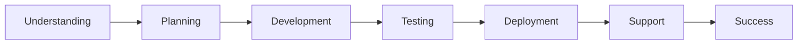

<div align="center">

# 👋 Hello, I'm **Anas Malik**


### 🚀 **Crafting Digital Excellence from Roorkee, India**

[](https://anasmalikportfolio.vercel.app/)
[](mailto:itsanas474@gmail.com)
[](https://www.linkedin.com/in/anasmalik57/)
[](mailto:itsanas474@gmail.com)


</div>

---

## 🎯 About Me

```javascript
const anasmalik = {
    role: "Full Stack Developer",
    location: "Roorkee, Uttarakhand, India 🇮🇳",
    education: "BCA Graduate (2025) | Maa Shakumbhari University",
    languages: ["English", "Hindi", "Urdu"],
    
    jobStatus: {
        availability: "✅ Immediately Available",
        lookingFor: ["Full-time", "Contract", "Freelance"],
        workMode: ["Remote", "Hybrid", "On-site"],
        preferredIndustries: ["Tech Startups", "E-commerce", "SaaS", "Agencies"]
    },
    
    expertise: {
        frontend: ["React", "Next.js", "TypeScript", "TailwindCSS"],
        backend: ["Node.js", "Express.js", "MongoDB", "PostgreSQL"],
        mobile: ["React Native", "Expo"],
        tools: ["Git", "Docker", "AWS", "Vercel"]
    },
    
    experience: [
        "AWS Solution Architect Certified",
        "Software Development Intern @ Febtech IT Solutions",
        "500+ GitHub Contributions",
        "Multiple Production Projects Delivered"
    ],
    
    strengths: [
        "Fast learner & problem solver",
        "Clean, scalable code architecture",
        "Strong communication skills",
        "Deadline-oriented delivery"
    ],
    
    currentFocus: "Building modern web & mobile applications",
    contactResponse: "< 2 hours"
};
```


---

## 💼 What I Offer

<div align="center">


</div>

### 🏢 **For Companies & Full-time Roles**

<table>
<tr>
<td width="50%">

**🎯 Technical Skills**
- ✅ Production-ready web applications
- ✅ Scalable MERN stack architecture
- ✅ RESTful API development
- ✅ Database design & optimization
- ✅ Cloud deployment (AWS, Vercel)
- ✅ Git workflows & CI/CD

</td>
<td width="50%">

**💡 Soft Skills**
- ✅ Team collaboration & Agile methodology
- ✅ Clear technical documentation
- ✅ Problem-solving mindset
- ✅ Quick learning & adaptability
- ✅ Multilingual communication
- ✅ Client-focused approach

</td>
</tr>
</table>

### 💼 **For Freelance Projects**

| 🎨 Service | 📝 Description | ⚡ Timeline |
|-----------|---------------|-----------|
| **🌐 Full Stack Web Apps** | Complete MERN stack applications | 2-4 weeks |
| **📱 Mobile Applications** | Cross-platform React Native apps | 3-6 weeks |
| **🎯 Landing Pages** | High-converting responsive pages | 3-7 days |
| **⚙️ Backend APIs** | RESTful APIs with Node.js | 1-2 weeks |
| **🎨 Frontend Development** | Modern UI with animations | 1-2 weeks |
| **🔧 Maintenance & Support** | Bug fixes and feature additions | 1-3 days |


---

## 🛠️ Tech Stack

<div align="center">


<br><br>

### **Frontend Development**


### **Backend Development**


### **Mobile Development**


### **Cloud & DevOps**


### **Tools & Others**


</div>


---

## 📊 GitHub Statistics

<div align="center">


<br><br>


</div>


---

## 💼 Professional Experience

<div align="center">


</div>

### 🏢 **Work Experience**

**💼 Software Development Intern** | *Febtech IT Solutions Limited*
- Developed production-ready features using MERN stack
- Collaborated with cross-functional teams
- Implemented responsive UI components
- Participated in code reviews and agile sprints

**☁️ AWS Solution Architect** | *Job Simulation*
- Designed scalable cloud infrastructure
- Implemented AWS best practices
- Cost optimization strategies
- Security and compliance implementation

### 🎓 **Education**

**🎓 Bachelor of Computer Applications (BCA)** | *2025*  
Maa Shakumbhari University, Saharanpur  
*Relevant Coursework: Data Structures, Algorithms, Database Management, Web Development*

### 🏆 **Achievements**

✅ **500+** GitHub Contributions in the last year  
✅ **30+** Projects Successfully Delivered  
✅ **AWS** Solution Architect Certified  
✅ **Multiple** Open Source Contributions  
✅ **Consistent** 4-6 hours daily coding practice  

---

## 💰 Freelance Pricing

<div align="center">


<br><br>

| 📦 Package | 💵 Price Range | ⏱️ Delivery | ✨ Includes |
|-----------|---------------|------------|-----------|
| **Starter** | ₹5,000 - ₹15,000 | 3-7 days | Landing Pages, Simple Sites |
| **Professional** | ₹15,000 - ₹40,000 | 2-3 weeks | Full Stack Apps, E-commerce |
| **Enterprise** | ₹40,000+ | 4-8 weeks | Complex Systems, Mobile Apps |
| **Hourly Rate** | ₹500/hour | Flexible | Consultations, Bug Fixes |

**✨ All packages include:**  
✅ Responsive Design  
✅ Clean Code  
✅ Documentation  
✅ 30 Days Support  
✅ Unlimited Revisions  
✅ Source Code

</div>

---

## 🎯 Why Choose Me?

<div align="center">


</div>

<table>
<tr>
<td width="33%">

### 🚀 **For Employers**
- Fresh perspective with modern skills
- Quick learner & adaptable
- Team player mentality
- Long-term commitment
- Multilingual (English, Hindi, Urdu)
- Ready to relocate if needed

</td>
<td width="33%">

### 💼 **For Clients**
- Transparent communication
- Regular progress updates
- On-time delivery
- Post-project support
- Fair & competitive pricing
- Quality guaranteed

</td>
<td width="33%">

### 💡 **Technical Edge**
- Modern tech stack
- Clean, maintainable code
- Performance optimized
- Security conscious
- Best practices followed
- Scalable solutions

</td>
</tr>
</table>

### 📈 **My Approach**



---

## 🎨 Featured Projects

<div align="center">


<br><br>

[](https://github.com/Anasmalik57/YOUR_REPO_1)
[](https://github.com/Anasmalik57/YOUR_REPO_2)

**🔗 [View All Projects →](https://github.com/Anasmalik57?tab=repositories)**

</div>

---

## 📞 Get In Touch

<div align="center">


<br>


<br><br>

### 📧 **Contact Information**

**📧 Email:** [itsanas474@gmail.com](mailto:itsanas474@gmail.com)  
**💼 Portfolio:** [anasmalikportfolio.vercel.app](https://anasmalikportfolio.vercel.app/)  
**🔗 LinkedIn:** [linkedin.com/in/anasmalik57](https://www.linkedin.com/in/anasmalik57/)  
**📱 Phone:** Available on request

<br>

### 🌍 **Availability & Preferences**

```
📍 Location: Roorkee, Uttarakhand, India
🌐 Work Mode: Remote | Hybrid | On-site (Flexible)
⏰ Timezone: IST (UTC+5:30) - Can adjust for teams
💼 Looking For: Full-time | Contract | Freelance
📨 Response Time: Within 2 hours
🗣️ Languages: English, Hindi, Urdu
✅ Status: Immediately Available
```

<br>

[](https://anasmalikportfolio.vercel.app)
[](https://www.fiverr.com/s/2KNzxeq)
[](https://www.linkedin.com/in/anasmalik57)
[](https://anasmalikportfolio.vercel.app/resume.pdf)

</div>

---

## 🌟 Client & Employer Testimonials

<div align="center">


> *"Delivered ahead of schedule with excellent quality. Great communication!"*  
> **— Happy Client**

> *"Professional, skilled, and a pleasure to work with. Highly recommend!"*  
> **— Satisfied Customer**

> *"Great team player with strong technical skills. Asset to any company!"*  
> **— Previous Employer**

</div>

---

---

<div align="center">

## 💭 Developer Philosophy


<br><br>

## 📊 Profile Analytics


<br>


<br>

### 🎯 **Ready to collaborate? Let's connect!**

**⭐ Star my repositories | 🤝 Open for opportunities | 💼 Let's work together**

<br>

**Crafted with ❤️ by [Anas Malik](https://github.com/Anasmalik57)**


</div>
